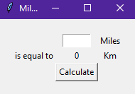
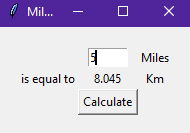

# Conversor Milhas -> Kilômetros
Graphical User Interface (GUI) básica que converte distâncias digitadas em Milhas para Kilômetros.

** CONVERSOR EM FUNCIONAMENTO:  **

Basta digitar a distância a ser convertida e clicar no botão 'Calculate'

  
---
**Desenvolvido por:** Anderson Luis

**GitHub:** https://github.com/andluis35

**Linkedin:** www.linkedin.com/in/anderson-luis-663970325

## Módulos Utilizados
* TKinter
